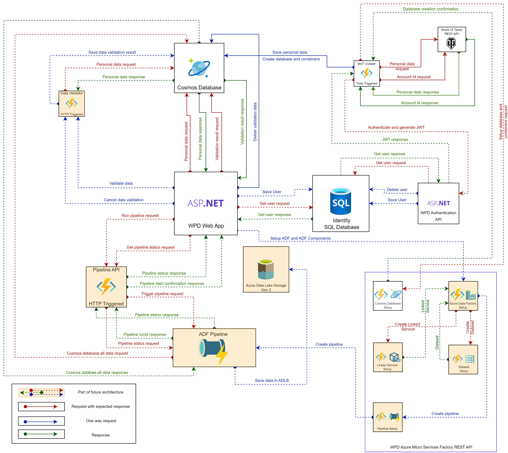

# World Of Tanks Personal Data Collector

## Description
World Of Tanks Personal Data Collector or WPD in brief is a 
.Net project build as time-triggered Azure Function. This project allows
a user to collect the latest data about account like battles, average damage, etc. using [World Of Tanks REST API](https://developers.wargaming.net/documentation/guide/principles/).

At this time function crawl data about user id after providing username as a local variable.
In the future, this program will also crawl data about a given user, Ex. battles, average damage, etc.
and it will store this data in CosmosDB. The project is ready to deploy as an azure app, but you can run it locally. 
Solution include also 225 unit tests written in the NUnit testing framework

For more information go to section called: Versions 
## About Solution

Solution is build in .Net 6.0 with C# 10, using azure function version is 4, ASP.NET. Everything was created using Visual Studio Enterprise 2022 

Used NuGet packages:

- Any ver. 8.2.0
- Coverlet.collector ver. 3.2.0
- FluentAssertions ver. 6.9.0
- Guard.Net ver. 3.0.0
- Microsoft.AspNetCore.Diagnostics.EntityFrameworkCore ver. 6.0.11
- Microsoft.AspNetCore.Identity.EntityFrameworkCore ver. 6.0.11
- Microsoft.AspNetCore.Identity.UI ver. 6.0.11
- Microsoft.Azure.Cosmos ver. 3.31.2
- Microsoft.Azure.Functions.Extensions ver. 1.1.0
- Microsoft.Extensions.DependencyInjection ver. 6.0.1
- Microsoft.EntityFrameworkCore.Cosmos ver. 6.0.11
- Microsoft.EntityFrameworkCore.Tools ver. 6.0.11
- Microsoft.NET.Sdk.Functions ver. 4.1.3
- Microsoft.NET.Test.Sdk ver. 17.4.0
- MockQueryable.NSubstitute ver. 7.0.0
- NSubstitute ver. 4.4.0
- NUnit ver. 3.13.3
- NUnit.Analyzers ver. 3.5.0
- NUnit3TestAdapter ver. 4.3.1
- TddXt.Any.Extensibility ver. 6.7.0
 

## Versions
Version name - Description - Status
- WPD-1-CrawlDataAboutUser - Crawling Data About User id using WOT REST API - Finished and merged
- WPD-2-ImplementChainOfResponsibility - Refactored azure function to implement chain of responsibility design pattern - Finished and merged
- WPD-3-CrawlSpecificUserData - Crawling specific data from WOT REST API about given user - Finished and merged
- WPD-4-SaveDataToCosmosDB - Reorganize data and save data to CosmosDB - Finished and merged
- WPD-5-DisplayCollectedDataInAspNetApp - Prototype version - Displaying saved data from CosmosDb in ASP.NET app also include prototype versioning check classes - Finished and merged
- WPD-6-ImplementVersionCheckForAspNetApp - Implement controller for version check - Finished and merged
- WPD-7-ImproveValidationResultsView - Improve ValidationResults view, so it contains paging, sorting - Finished and merged
- WPD-8-CreateResourceFiles - Create resource file for strings etc. - Planned
- WPD-9-ImplementCleaningValidationResult - Implement endpoint for deleting all validation results - Planned
- WPD-10-ImplementSharedKernel - Implement kernel that is shared between projects - Planned

Application Architecture Change is planned after WPD-10 version

- WPD-11-ImplementHttpTriggeredAzureFunctionForDbDtoVersionCheck - Create HTTP Triggered Azure Function for Cosmos Db and ASP.Net dto version check - Planned
- WPD-12-RemoveVersionCheckFromAspNetAppAndImplementConnectionWithWpdDtoValidationApp - HTTP Triggered Azure Function - Planned
- WPD-13-CreateWpdAzureMicroServicesFactoryAPIBasedOnHttpTriggeredAzureFunction - Create WPD Azure Function (Rest API) that will handle setting up azure components' ex. creating database or ADF - Planned
- WPD-14-ImplementEndpointForCosmosDbSetUp - Implement endpoint in WPD Azure Micro Services Factory API for setting up database and containers - Planned
- WPD-15-SeparateCosmosDbSetUpFromWotDataCrawlerIntoWpdMicroServicesFactoryAPI - Remove Cosmos Db SetUp from Wot crawler and implement connection with WPD Micro Services Factory API for Cosmos DB setup - Planned
- WPD-16-ImplementEndpointForAdfCreate - Implement endpoint in WpdMicroServicesFactoryAPI for creating Azure Data Factory - Planned
- WPD-17-ImplementLinkedServiceFactory - Implement linked service factory in WpdMicroServicesFactoryAPI - Planned
- WPD-18-ImplementDatasetFactory - Implement dataset factory in WpdMicroServicesFactoryAPI - Planned
- WPD-19-ImplementPipelineFactory - Implement pipeline factory in WpdMicroServicesFactoryAPI - Planned
- WPD-20-IncreaseCodeCoverage - Adding/modifying tests to increase code coverage - Planned
- WPD-21-ImplementIntegrationTestForVersioning - Implement integration tests for various cases with versioning check from Cosmos DB - Planned
- WPD-22-DisplayDataFromCosmosDbInPrettyWay - Displaying saved data from CosmosDb in pretty way - Planned
- WPD-23-AddMissingDocumentation - Add missing documentation for classes and interfaces - Planned

## Architecture
Current architecture with future architecture elements


## CosmosDb

To run application you have to provide CosmosDb Primary Connection String. You can use 
Cosmos database from [Azure Portal](https://azure.microsoft.com/en-us/products/cosmos-db/) or 
you can set up database locally. Tutorial how to install Azure Cosmos Db Emulator is available here on 
[Microsoft Documentation](https://learn.microsoft.com/en-us/azure/cosmos-db/local-emulator?tabs=ssl-netstd21). 
All crawled data will be stored in database named *WotUserData* and in container named *WotAccountData*

## ASP.NET App

Follow Local Installation to install your app correctly. After you run application go to _"https://localhost:7097/Wot/All"_ to see if result
are displayed correctly from Cosmos DB. You should see multiple times your account create date. If you don't see anything probably cosmos db is empty.
Null fixes and protection will be available from next versions.

### Note
This version is prototype version of web app. New features will be implemented in the future. Follow versioning to see what changes
will be made in the future. *Version* controller is now not available and will be activated in next app version.

## Local Installation

### Azure app
To use this app locally you have to install Visual Studio 2022. 
After this clone solution and add *local.settings.json*
inside WotPersonalDataCollector folder (the same folder which contains azure function)
In this file add and fill missing data. File should look like this:

```json
{
    "IsEncrypted": false,
  "Values": {
    "AzureWebJobsStorage": "UseDevelopmentStorage=true",
    "FUNCTIONS_WORKER_RUNTIME": "dotnet",
    "ApplicationId": "Type your own WOT API Application Id",
    "WotUserName" : "type your own username ",
    "PlayersUri": "https://api.worldoftanks.eu/wot/account/list/",
    "PersonalDataUri": "https://api.worldoftanks.eu/wot/account/info/",
    "CosmosConnectionString": "Find this property in your Cosmos DB in Azure Portal or in Azure Cosmos DB Emulator",
    "CosmosDbName": "WotUserData",
    "DatabaseThroughput": "Manual throughput this variable can not be lower than 400!",
    "ContainerName": "WotAccountData",
    "DtoVersion": "1.0.0"
  }
}
```
### ASP.NET app 
To use asp.net app locally you have to provide some environmental variables. To do this create file named *launchSettings.json*
in folder _"WotPersonalDataCollector\WotPersonalDataCollectorWebApp\Properties"_ If you don't have folder *Properties* create one.
In this file add and fill missing data. File should look like this:
```json
{
  "profiles": {
    "WotPersonalDataCollectorWebApp": {
      "commandName": "Project",
      "launchBrowser": true,
      "environmentVariables": {
        "ASPNETCORE_ENVIRONMENT": "Development",
        "DatabaseName": "WotUserData",
        "ContainerName": "WotAccountData",
        "WotDtoVersion": "1.0.0",
        "CosmosConnectionString": "Find this property in your Cosmos DB in Azure Portal or in Azure Cosmos DB Emulator"
      },
      "dotnetRunMessages": true,
      "applicationUrl": "https://localhost:7097;http://localhost:5080"
    },
    "IIS Express": {
      "commandName": "IISExpress",
      "launchBrowser": true,
      "environmentVariables": {
        "ASPNETCORE_ENVIRONMENT": "Development"
      }
    }
  },
  "iisSettings": {
    "windowsAuthentication": false,
    "anonymousAuthentication": true,
    "iisExpress": {
      "applicationUrl": "http://localhost:57541",
      "sslPort": 44325
    }
  }
}
```

### Note
Note that ASP.NET app won't work correctly without data in Cosmos DB. 
To use this app you should run first azure app to collect data.


After adding both of this files run your azure app using VS 2022. 
To run tests you can use VS 2022 or type in powershell:
```bash
dotnet test
```
To build solution type:


```bash
dotnet build
```

## Azure portal installation

If you want to run this app in Azure. Set up this project in Azure Portal and add all listed above local
variables in Configuration -> Application Settings -> New application setting
You can deploy application via [Azure DevOps Pipeline](https://azure.microsoft.com/en-us/products/devops/).
You can find a tutorial for this on 
[Microsoft Documentation](https://learn.microsoft.com/en-us/azure/app-service/deploy-azure-pipelines?view=azure-devops&tabs=yaml)
## Configuration 
In WotPersonalDataCrawler.cs change argument value in TimeTrigger attribute to trigger 
function on different period of time. Attribute use NCRONTAB expressions more about this in [documentation](https://docs.microsoft.com/en-us/azure/azure-functions/functions-bindings-timer?tabs=in-process&pivots=programming-language-csharp)
Example of this app triggered once every one hour:
```csharp
public async Task Run([TimerTrigger("0 0 */1 * * *")]TimerInfo myTimer, ILogger log)
```
